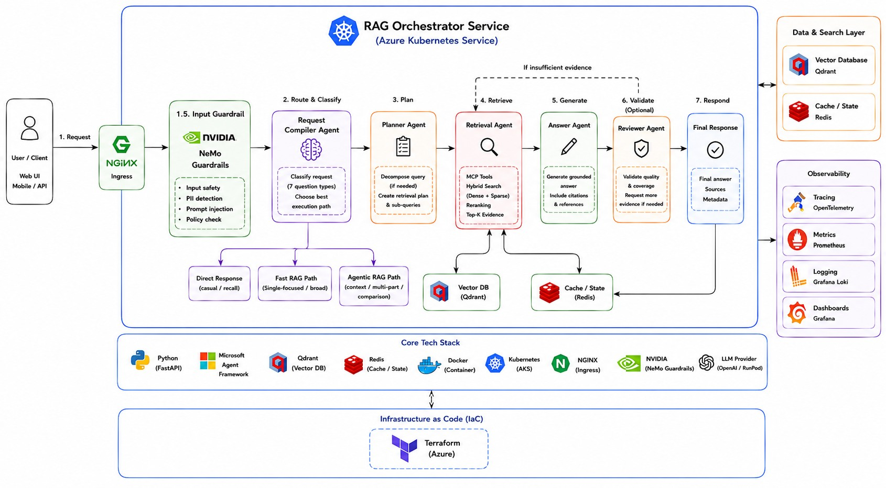

# Agentic RAG for the California DMV Handbook

An agentic RAG system for answering questions from the California DMV Driver's Handbook.

I built this project mainly to explore how a RAG application changes when different types of questions are handled differently instead of sending every request through the same retrieval or rag pipeline.

The system has separate paths for simple questions, conversational follow-ups, multi-part questions, and comparisons. Complex queries can be decomposed into sub-questions, retrieved in batch, checked for evidence coverage, and reviewed before the final response.

The project also includes an end-to-end evaluation pipeline, Kubernetes deployment, infrastructure as code, metrics, and distributed tracing.

---

## Architecture Overview



For a detailed breakdown of the workflow and system design, see [Architecture](docs/ARCHITECTURE.md).

---

## Demo

<!-- screenshot  -->

---

How it works

The request flow depends on the type of question.

```text
User
 │
 ▼
FastAPI / WebSocket
 │
 ▼
Question Classification
 │
 ├── Casual conversation ───────────────→ Direct response
 │
 ├── Conversation recall ───────────────→ Session history
 │
 ├── Context-dependent ─→ Rewrite query ─┐
 │                                        │
 ├── Single / broad ─────→ Fast plan ─────┤
 │                                        │
 └── Multi-part / comparison → Planner ───┤
                                          ▼
                                  Batch MCP Retrieval
                                          │
                                  Dense + Sparse Search
                                          │
                                       Qdrant
                                          │
                                         RRF
                                          │
                                  Cross-Encoder Reranker
                                          │
                                  Evidence Aggregation
                                          │
                          ┌───────────────┴───────────────┐
                          │                               │
                     Enough evidence                 Missing evidence
                          │                               │
                     Generate answer                Targeted retrieval
                          │
                   Optional reviewer
                          │
                          ▼
                     Final response
```

The orchestration layer is implemented with Microsoft Agent Framework.

---

## Query Routing

The workflow currently handles seven question types.

| Type | Example | Path |
|---|---|---|
| `casual_conversation` | "Hello" | Direct response |
| `conversation_recall` | "What did I just ask?" | Conversation history |
| `single_focused` | "When should I signal before turning?" | Fast retrieval |
| `broad_coverage` | "What should I know about freeway driving?" | Broad retrieval |
| `context_dependent` | "What about drivers under 18?" | Context rewrite + retrieval |
| `multi_part` | "How do I make a right turn and a left turn?" | Decomposition + batch retrieval |
| `comparison` | "How are permits and licenses different?" | Decomposition + review |

Simple requests do not go through the full planner/reviewer workflow.

For context-dependent questions, recent conversation history is used to rewrite the question into a standalone retrieval query before retrieval.

---

## Retrieval

Retrieval runs behind an MCP service and exposes a batch search tool.

For a multi-part question:

```text
sub-question 1 ─┐
sub-question 2 ─┤
sub-question 3 ─┼── batch_semantic_search()
sub-question 4 ─┘
                        │
                        ├── Dense embeddings
                        └── Sparse embeddings
                                │
                                ▼
                         Qdrant batch query
                                │
                       Dense + Sparse results
                                │
                                ▼
                               RRF
                                │
                                ▼
                       Cross-Encoder Reranker
                                │
                                ▼
                            Evidence
```

### Dense Retrieval

Dense embeddings use:

```text
Alibaba-NLP/gte-modernbert-base
```

The embedding model runs through ONNX Runtime using an INT8 model.

### Sparse Retrieval

Sparse retrieval uses Qdrant BM25 / FastEmbed.

I kept sparse retrieval because DMV questions often contain exact terms, numbers, license classes, age requirements, and other wording that dense retrieval alone can miss.

### Fusion and Reranking

Dense and sparse candidates are combined using Reciprocal Rank Fusion.

The fused candidates are then reranked with:

```text
Alibaba-NLP/gte-reranker-modernbert-base
```

using a quantized ONNX cross-encoder.

---

## Evidence Handling

Retrieved chunks are grouped by sub-question before answer generation.

For complex questions, the workflow checks whether the retrieved evidence covers the requested parts of the question.

If evidence is missing, the system can generate a targeted retrieval query and run another retrieval round.

The workflow also has limits for:

- model calls
- retrieval rounds
- number of sub-questions
- request execution time

This keeps recovery loops bounded.

Conversation history and retrieved evidence are kept separate.

Conversation history is used to understand follow-up questions, while factual DMV claims are expected to come from retrieved document chunks.

Multi-part and comparison answers can also go through a reviewer before being returned.

---

## Evaluation

I built a separate end-to-end evaluation pipeline instead of evaluating only a few manually selected questions.

The current dataset contains **50 questions** across five retrieval-related question types:

- `single_focused`
- `broad_coverage`
- `context_dependent`
- `multi_part`
- `comparison`

### Current Results

| Metric | Result |
|---|---:|
| Test cases | 50 |
| Route match | 97.5% |
| Semantic retrieval recall | 93.5% |
| Answer completeness | 87.0% |
| Answer correctness | 77.5% |
| Unsupported-material pass | 78.0% |
| Median latency | 10.14 s |
| p95 latency | 14.83 s |
| Average model calls | 2.96 |
| Average retrieval rounds | 1.0 |

Retrieval quality is scored semantically from the text actually returned by the system instead of relying only on expected chunk IDs.

This is useful because chunk IDs can change after re-ingestion even when the retrieved content still supports the same claim.

The weakest category in the current evaluation is broad-coverage questions. Retrieval recall is generally strong, while answer correctness and grounding still have room for improvement.

More details are available in [docs/EVALUATION.md](docs/EVALUATION.md).

---

## Observability

Both the RAG orchestrator and MCP retrieval service expose Prometheus metrics.

```text
RAG /metrics ───┐
                ├── Prometheus ──→ Grafana
MCP /metrics ───┘
```

Distributed traces are exported through OpenTelemetry.

```text
RAG ──┐
      ├── OpenTelemetry Collector ──→ Tempo ──→ Grafana
MCP ──┘
```

I use metrics mainly for aggregate latency and error monitoring, while traces are useful for debugging individual requests across the RAG and retrieval services.

---

## Deployment

The application is containerized and can be deployed on Azure Kubernetes Service.

```text
Client
  │
  ▼
NGINX Ingress
  │
  ▼
RAG Orchestrator
  │
  ├── Redis
  │
  ├── MCP Retrieval Service
  │       │
  │       └── Qdrant
  │
  └── LLM Provider
```

Terraform is used to provision the Azure infrastructure, while application services are deployed with Kubernetes and Helm.

The repository also contains configurations for:

- NGINX Ingress
- Prometheus
- OpenTelemetry Collector
- Tempo
- Grafana
- NVIDIA NeMo Guardrails

See [docs/DEPLOYMENT.md](docs/DEPLOYMENT.md) for the full setup.

---


## Tech Stack

### Application

- Python
- FastAPI
- WebSocket
- Microsoft Agent Framework
- FastMCP

### Retrieval

- Qdrant
- `Alibaba-NLP/gte-modernbert-base`
- Qdrant BM25 / FastEmbed
- Reciprocal Rank Fusion
- `Alibaba-NLP/gte-reranker-modernbert-base`
- ONNX Runtime

### State

- Redis

### Infrastructure

- Docker
- Kubernetes
- Azure AKS
- Helm
- Terraform
- NGINX Ingress

### Observability

- Prometheus
- OpenTelemetry
- Tempo
- Grafana

### Evaluation

- Custom end-to-end evaluation pipeline
- Semantic LLM judge

---

## Repository Structure

```text
.
├── RAG/
│   ├── autogen-orchestrator/
│   └── ingesting-vdb/
│
├── evaluation/
│   ├── configs/
│   ├── datasets/
│   ├── e2e/
│   ├── generation/
│   ├── reports/
│   ├── results/
│   ├── runtime/
│   └── scorers/
│
├── deployment/
│   ├── mcp_server/
│   ├── rag-orchestrator/
│   ├── vector-db/
│   ├── redis/
│   ├── nginx-ingress/
│   ├── keda-scale/
│   ├── otel/
│   └── prometheus/
│
├── iac/
│   └── terraform/
│
├── data/
│
└── docs/
    ├── ARCHITECTURE.md
    ├── DEPLOYMENT.md
    └── EVALUATION.md
```
---

## Documentation

- [Architecture](docs/ARCHITECTURE.md) — workflow, retrieval design, evidence flow, and design decisions
- [Deployment](docs/DEPLOYMENT.md) — Azure / AKS setup and deployment instructions
- [Evaluation](docs/EVALUATION.md) — dataset, evaluation methodology, results, and failure analysis

---

## Current Limitations

There are still a few areas I want to improve:

- Broad-coverage questions are less consistent than focused questions.
- Agentic paths are relatively slow because most end-to-end latency comes from model inference.
- The current evaluation corpus is limited to the California DMV handbook.
