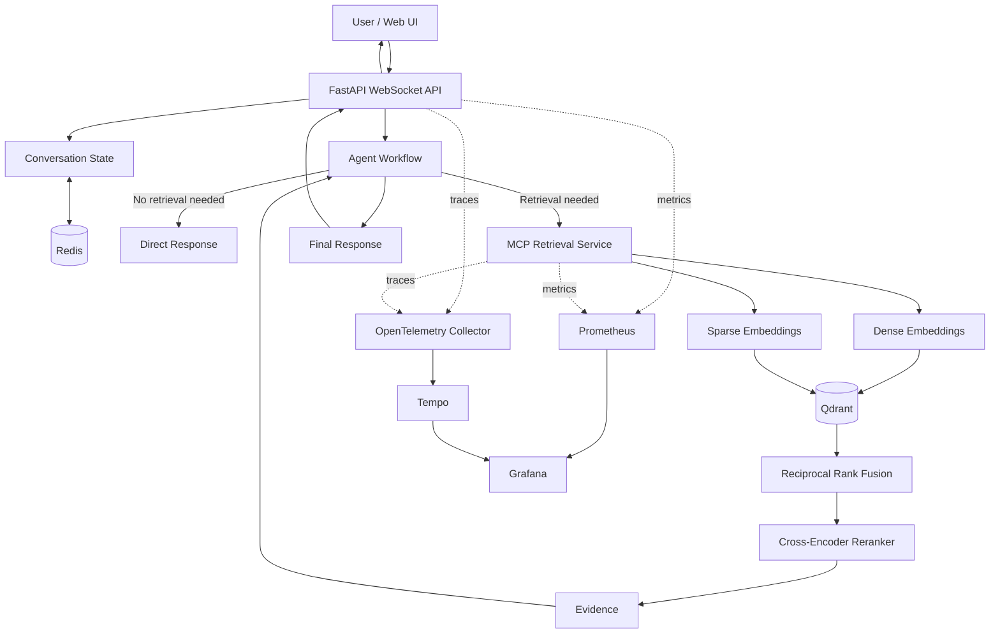
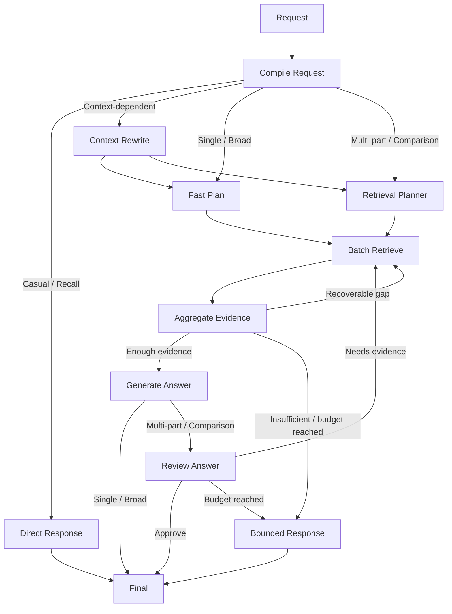

# Architecture

This document describes how the system is structured and how a request moves through the RAG workflow.

The current system uses Microsoft Agent Framework for orchestration, an MCP retrieval service for search, Qdrant for hybrid retrieval, Redis for conversation state, and separate evaluation and observability layers around the application.

---

## 1. High-Level Architecture

At a high level, the system has four main parts:

1. the WebSocket application and orchestration workflow
2. the MCP retrieval service
3. state and storage services
4. deployment and observability infrastructure



The orchestration and retrieval layers are kept separate. The workflow decides what information is needed, while the MCP service handles how that information is retrieved.

---


## 2. Request Lifecycle

A request enters through the FastAPI WebSocket endpoint.

The rough lifecycle is:

```text
WebSocket request
      │
      ▼
Load recent conversation state
      │
      ▼
Compile / classify request
      │
      ├── No retrieval needed
      │        │
      │        ▼
      │   Direct response
      │
      └── Retrieval needed
               │
               ▼
        Build retrieval plan
               │
               ▼
          MCP retrieval
               │
               ▼
       Aggregate evidence
               │
               ▼
        Answer generation
               │
        Optional review
               │
               ▼
          Final response
```

The exact path depends on the shape of the user's question.

A greeting, a focused DMV question, a conversational follow-up, and a multi-part comparison should not all require the same number of model calls or retrieval operations.

---

## 3. Question Shapes

The workflow currently handles seven question shapes:

```text
casual_conversation
conversation_recall
single_focused
broad_coverage
context_dependent
multi_part
comparison
```

These shapes determine which parts of the workflow are used.

### 3.1 Casual Conversation

Example:

```text
Hello
```

No document retrieval is needed.

```text
User
  ↓
Compiler
  ↓
casual_conversation
  ↓
Direct response
```

This avoids running Qdrant, reranking, planning, or answer verification for small talk.

### 3.2 Conversation Recall

Example:

```text
What did I just ask?
```

This is answered using recent conversation state rather than the DMV corpus.

```text
User
  ↓
Compiler
  ↓
conversation_recall
  ↓
Conversation history
  ↓
Response
```

Conversation recall and document retrieval are treated as different problems.

### 3.3 Single Focused

Example:

```text
How far before a turn should I signal?
```

This normally needs one retrieval query and does not require full decomposition.

```text
User
  ↓
Compiler
  ↓
single_focused
  ↓
Fast retrieval plan
  ↓
MCP retrieval
  ↓
Evidence
  ↓
Answer
```

This is one of the lower-cost RAG paths in the workflow.

### 3.4 Broad Coverage

Example:

```text
What should I know about freeway driving?
```

Broad questions still use retrieval, but they need wider evidence coverage than focused fact lookups.

This has been one of the harder categories in evaluation because retrieving relevant chunks is not always the same as retrieving enough different pieces of evidence to cover a broad answer.

### 3.5 Context Dependent

Example:

```text
User: What are the requirements for a learner permit?

User: What about drivers under 18?
```

The second question cannot be retrieved reliably by itself because its meaning depends on the previous turn.

The system first rewrites it into a standalone query.

```text
What about drivers under 18?
          │
          ▼
Recent conversation history
          │
          ▼
Context Rewriter
          │
          ▼
What are the learner permit requirements
for California drivers under 18?
          │
          ▼
Re-enter retrieval workflow
```

The rewritten query can then be classified again and sent through the appropriate retrieval path.

Conversation history is used to resolve the user's intent, but it does not become factual evidence for the DMV answer.

### 3.6 Multi-Part

Example:

```text
What are the steps to make a right turn,
and how do I properly execute a left turn?
```

A single vector search may retrieve good evidence for one part while missing the other.

The planner decomposes the request into smaller retrieval units.

```text
Original question
      │
      ▼
Retrieval Planner
      │
      ├── sq1: right-turn procedure
      └── sq2: left-turn procedure
               │
               ▼
      batch_semantic_search()
```

The sub-questions are then retrieved together in one batch.

### 3.7 Comparison

Example:

```text
What is the difference between a learner permit
and a driver's license?
```

Comparison questions normally require evidence from both sides.

They use the more complete workflow:

```text
Question
   ↓
Decomposition
   ↓
Batch retrieval
   ↓
Evidence grouping
   ↓
Answer
   ↓
Reviewer
   ↓
Final response
```

The reviewer is useful here because a fluent comparison can still be incomplete if one side is weakly supported.

---

## 4. Workflow Orchestration

The orchestration layer is implemented with Microsoft Agent Framework.

The workflow is a bounded execution graph rather than an open-ended agent conversation.

A simplified version looks like this:




The main point is that the transitions are explicit.

Agents do not continue deciding which agent should run next.

---

## 5. Request Compiler

The request compiler is the first decision point of the pipeline.

It converts the user request and available conversation context into structured workflow state.

Conceptually:

```text
Raw request
    +
Recent context
      │
      ▼
Request Compiler
      │
      ├── question shape
      ├── normalized request
      └── route information
```

This lets the rest of the workflow operate on structured state instead of repeatedly interpreting from the raw conversation.

---

## 6. Fast Path vs Agentic Path

One of the main decisions in the project was not to run the full planner and reviewer path for every RAG request.

### Fast Path

Used mainly for:

```text
single_focused
broad_coverage
```

Typical flow:

```text
Compile
  ↓
Fast plan
  ↓
Retrieve
  ↓
Aggregate
  ↓
Answer
  ↓
Final
```

### Full Agentic Path

Used mainly for:

```text
multi_part
comparison
```

Typical flow:

```text
Compile
  ↓
Planner
  ↓
Sub-question decomposition
  ↓
Batch retrieval
  ↓
Evidence aggregation
  ↓
Answer
  ↓
Reviewer
  ↓
Final
```

This keeps the workflow adaptive instead of using the most expensive route by default.

---

## 7. Retrieval Boundary

Retrieval runs behind an MCP service.

The orchestrator does not directly manage the vector database, embedding runtime, sparse encoder, or reranker.

Instead, it calls an MCP retrieval tool.

The current primary retrieval interface is:

```text
batch_semantic_search(...)
```

The boundary looks roughly like this:

```text
Orchestration layer
        │
        │ retrieval request
        ▼
MCP tool contract
        │
        ▼
Retrieval runtime
        │
        ├── dense embeddings
        ├── sparse embeddings
        ├── Qdrant
        └── reranker
```

---

## 8. Batch Retrieval

Complex questions may contain several sub-questions.

Instead of making a separate MCP call for every one of them, the system sends them together.

```text
sq1 ─┐
sq2 ─┤
sq3 ─┼── batch_semantic_search()
sq4 ─┘
```

The retrieval runtime can then batch the work:

```text
Sub-questions
     │
     ├── Batch dense embedding
     │
     ├── Batch sparse embedding
     │
     ▼
Qdrant query_batch_points()
     │
     ▼
Candidate results
     │
     ▼
Shared reranking stage
```
---

## 9. Dense Retrieval

Dense retrieval uses:

```text
Alibaba-NLP/gte-modernbert-base
```

The embedding model runs through ONNX Runtime using an INT8 model.

Dense embeddings are useful for semantic matching.

For example, a user may ask:

```text
When do I need to notify other drivers before turning?
```

while the handbook may use wording closer to:

```text
signal during the last 100 feet before turning
```

Dense retrieval helps connect semantically similar expressions even when the wording is different.

---

## 10. Sparse Retrieval

Sparse retrieval uses Qdrant BM25 / FastEmbed.

Sparse search is useful for exact wording and specific terms that matter in the DMV domain, including:

- ages
- distances
- license classes
- traffic-sign terminology
- numeric limits
- legal phrases
- named permits or documents

Dense and sparse retrieval solve slightly different problems, so both are used.

---


## 11. Hybrid Retrieval and RRF

Dense and sparse candidates are retrieved through Qdrant and combined using Reciprocal Rank Fusion.

```text
                Query
                  │
        ┌─────────┴─────────┐
        │                   │
 Dense representation   Sparse representation
        │                   │
        └─────────┬─────────┘
                  ▼
               Qdrant
        ┌─────────┴─────────┐
        │                   │
   Dense ranking       Sparse ranking
        │                   │
        └─────────┬─────────┘
                  ▼
                 RRF
                  │
                  ▼
          Fused candidates
```

---

## 12. Cross-Encoder Reranking

The returned candidates are then reranked using:

```text
Alibaba-NLP/gte-reranker-modernbert-base
```

through a quantized ONNX cross-encoder.

The two stages have different jobs:

```text
Dense / sparse retrieval
        ↓
Find a reasonably small candidate set

Cross-encoder
        ↓
Score query-document pairs more precisely
```

---

## 13. Reranking Budget

The reranker has a bounded query-document pair budget.

For multi-part requests, simply taking the first N candidates can create a coverage problem.

For example:

```text
sq1 → 8 candidates
sq2 → 8 candidates
sq3 → 8 candidates
```

If the total reranking budget is limited, processing all candidates for `sq1` first could leave very little capacity for `sq2` and `sq3`.

The retrieval runtime instead distributes candidates across sub-questions.

Conceptually:

```text
round 1: sq1, sq2, sq3
round 2: sq1, sq2, sq3
round 3: sq1, sq2, sq3
...
until the reranking budget is reached
```

This makes the reranking budget more useful for coverage-oriented questions.

---

## 14. Evidence Contract

Retrieval returns structured evidence instead of only raw text.

Evidence keeps information needed later in the workflow, such as:

```text
sub_question_id
chunk identity
source metadata
section metadata
retrieval score
reranker score
text
```

This allows the workflow to preserve the relationship between:

```text
question requirement
      ↕
retrieved evidence
```
---

## 15. Evidence Aggregation

After retrieval, evidence is grouped by sub-question before answer generation.

For example:

```text
sq1
 ├── chunk A
 ├── chunk B
 └── chunk C

sq2
 ├── chunk D
 └── chunk E
```

The aggregation stage preserves which evidence belongs to which part of the question.

This gives the workflow more structure than simply concatenating every retrieved chunk into one large prompt.

---

## 16. Coverage and Gap Retrieval

For complex requests, the workflow checks whether enough evidence has been collected to answer the requested parts.

The possible states are roughly:

```text
sufficient evidence
recoverable evidence gap
insufficient evidence
```

A recoverable gap can trigger another targeted retrieval.

Example:

```text
Original question
   ↓
sq1: permit requirements
sq2: permit restrictions
sq3: license requirements
sq4: license restrictions
   ↓
Retrieval
   ↓
sq4 weak / missing
   ↓
Targeted gap query
   ↓
Retrieve missing evidence
```

The workflow does not continue this process indefinitely.

Recovery is limited by explicit execution budgets.

---

## 17. Answer Generation

The answer agent receives the user request and aggregated evidence.

For DMV factual claims, retrieved chunks are treated as the factual source.

The answer stage is mainly responsible for synthesis.

```text
Retrieval
→ find evidence

Answer agent
→ explain the evidence
```

---

## 18. Reviewer

The reviewer is mainly used for more complex question shapes such as:

```text
multi_part
comparison
```

Its job is to decide whether the answer can be finalized or whether the workflow still needs evidence.

A simplified reviewer decision is:

```text
Answer + evidence
       │
       ▼
    Reviewer
   ┌───┼────────────┐
   │   │            │
approve needs_more  bounded
```

If more evidence is needed and retrieval budget remains, the workflow can return to retrieval.

The reviewer is not used for every request because that would add another model call to simple questions without much benefit.

---

## 19. Conversation State

Redis is used for conversation/session state.

Recent history is mainly needed for:

1. conversation recall
2. context-dependent rewriting

Example:

```text
Turn 1:
How do learner permits work?

Turn 2:
What about minors?
```

The second request needs the first request to resolve what the user means.

However, conversation history is not treated the same way as retrieved DMV evidence.

```text
Conversation history
    → helps interpret the request

Retrieved document chunks
    → support factual claims
```

This reduces the chance that an earlier assistant answer is reused as if it were a source document.

---

## 20. Ingestion Pipeline

The retrieval index is built offline before the application serves requests.

At a high level:

```text
DMV source data
      │
      ▼
Parsing / cleaning
      │
      ▼
Structure-aware chunking
      │
      ▼
Metadata enrichment
      │
      ├── section information
      ├── heading path
      ├── chunk identity
      └── corpus version
      │
      ▼
Dense + sparse indexing
      │
      ▼
Qdrant collection
```

The ingestion pipeline is separate from the online retrieval runtime.

---

## 21. Chunk Metadata and IDs

Chunks carry metadata used by retrieval, evaluation, and source references.

Examples include:

```text
chunk_id
stable_id
section_id
heading_path
corpus_version
```

There is a distinction between storage-level identifiers and stable document identities.

A vector database point ID may change after a collection is rebuilt.

Stable metadata is more useful when an identity needs to persist across ingestion runs.

---

## 22. Corpus Versioning

The indexed corpus has an explicit version.

```text
DMV handbook
    ↓
corpus version
    ↓
chunks / metadata / Qdrant collection
```

## 23. Execution Budgets

The workflow has explicit limits instead of allowing agents to recover indefinitely.

The main limits include:

- maximum model calls
- maximum retrieval rounds
- maximum number of sub-questions
- request deadline

Conceptually:

```text
Request
  │
  ├── model call budget
  ├── retrieval budget
  ├── sub-question budget
  └── time budget
```

If the workflow cannot recover enough evidence within these limits, it moves to bounded termination.

---

---

## 24. Bounded Termination

The corpus may not always contain enough information, retrieval may fail to cover every requested part, or a request may reach its execution budget.

Instead of continuing another uncontrolled planner/reviewer cycle, the workflow stops.

```text
Need more evidence
      │
      ├── Budget available
      │       ↓
      │    Retrieve
      │
      └── Budget exhausted
              ↓
        Bounded response
```

---

## 25. Latency

Latency was one of the main reasons for splitting the workflow into different execution paths.

A complex request may involve:

```text
compiler
planner
retrieval
reranking
answer
reviewer
```

while a simple focused question does not need every stage.

The system therefore avoids unnecessary planner and reviewer calls for simpler requests.

---

## 26. Observability

The system uses both metrics and distributed traces.

They answer different debugging questions.

### Metrics

Both the orchestrator and MCP retrieval service expose Prometheus metrics.

```text
RAG /metrics ───────┐
                    ├── Prometheus ──→ Grafana
MCP /metrics ───────┘
```

Metrics are useful for aggregate behavior such as:

- request count
- error rate
- request latency
- retrieval latency
- model calls
- active requests
- embedding work
- Qdrant activity
- reranking work

### Distributed Tracing

The services also export traces through OpenTelemetry.

```text
RAG traces ────────┐
                   ├── OpenTelemetry Collector
MCP traces ────────┘
                              │
                              ▼
                            Tempo
                              │
                              ▼
                           Grafana
```

Traces are more useful when debugging one specific request.

For example:

```text
WebSocket request
      ↓
Compiler
      ↓
Planner
      ↓
MCP call
      ↓
Dense / sparse retrieval
      ↓
Reranking
      ↓
Answer model
      ↓
Reviewer
```

A trace makes it possible to see which stage is responsible for most of the request latency.

---

## 27. Deployment Architecture

The application is designed to run on Kubernetes and is currently deployed around Azure Kubernetes Service.


```text
                    Client
                      │
                      ▼
                 Azure Load Balancer
                      │
                      ▼
                  NGINX Ingress
                      │
                      ▼
               RAG Orchestrator
                  AKS Pods
                      │
        ┌─────────────┼─────────────┐
        │             │             │
      Redis      MCP Service    LLM Provider
                      │
                      ▼
                    Qdrant
```

Application deployment is handled through Kubernetes and Helm.

Cloud infrastructure is provisioned separately with Terraform.

```text
Terraform
   ↓
Cloud infrastructure

Helm / Kubernetes
   ↓
Application services
```

Deployment commands and environment configuration are documented separately in [DEPLOYMENT.md](DEPLOYMENT.md).

---

## 28. Service Boundaries

The main runtime responsibilities are separated approximately as follows.

### RAG Orchestrator

Responsible for:

- WebSocket handling
- conversation state
- question compilation
- context rewriting
- retrieval planning
- workflow state
- answer generation
- review
- final response events

### MCP Retrieval Service

Responsible for:

- dense embedding
- sparse embedding
- Qdrant retrieval
- RRF
- reranking candidate allocation
- cross-encoder reranking
- retrieval telemetry

### Redis

Responsible mainly for:

- recent conversation state
- session history

### Qdrant

Responsible for:

- indexed DMV chunks
- dense vectors
- sparse vectors
- hybrid candidate retrieval

---

## 29. Model Configuration

The orchestration layer supports configurable OpenAI-compatible model providers.

Different roles can use different model configurations.

For example:

```text
Compiler         → fast model
Context Rewriter → fast model
Planner          → planning model
Answer           → generation model
Reviewer         → verification model
```

The exact provider or model can change without changing the structure of the workflow.

---

## 30. Input Guardrails

The deployment repository also contains an NVIDIA NeMo Guardrails integration.

```text
User input
    │
Guardrail
    │
    ▼
RAG workflow
```

---

## 31. Related Documentation

- [README](../README.md) — project overview
- [Evaluation](EVALUATION.md) — dataset, scoring, results, and failure analysis
- [Deployment](DEPLOYMENT.md) — Azure, Kubernetes, Helm, Terraform, and service setup


